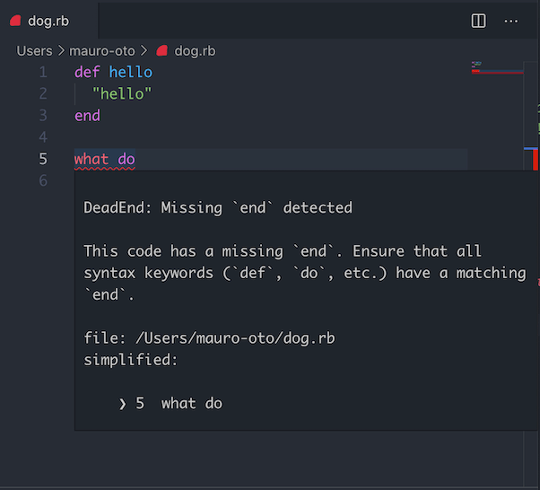

# DeadEnd for Visual Studio Code

[DeadEnd is a Ruby gem](https://github.com/zombocom/dead_end) that detects
syntax errors and finds the problem to have an easier time pinpointing where
issues in your Ruby code are.

## Usage

1. Add `dead_end` to your `Gemfile`:

```ruby
gem 'dead_end'
```

2. Execute:

```bash
$ bundle install
```

If your application is not calling `Bundler.require` then you must manually add a require

```ruby
require "dead_end"
```

3. Install the VS Code extension

## Screenshot


